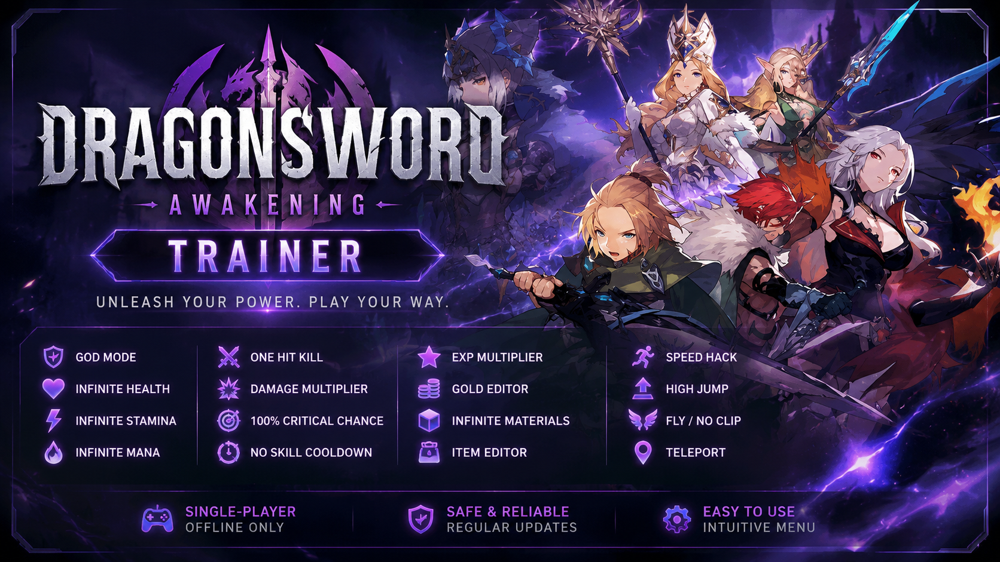

# DragonSword: Awakening — Trainer

Trainer for single-player playthroughs of **DragonSword: Awakening**.

    

    

    

    

    

> ⚠️ Single-player / offline use only. Do not use on servers with online rankings, PvP, or Steam-linked achievements — this may get your in-game account banned.

---

## Features

### Basics
| Feature | Description |
|---|---|
| ❤️ **God Mode** | Full immortality |
| ♾️ **Infinite HP** | Health never drops |
| 🔋 **Infinite Stamina** | Stamina never depletes |
| 🔮 **Infinite Mana/Skill Energy** | Unlimited resource for abilities (if applicable) |

### Combat
| Feature | Description |
|---|---|
| 💥 **One Hit Kill** | Defeat enemies in a single hit |
| ⚔️ **Damage Multiplier** | Adjustable ×1–×100 |
| 🛡️ **Defense Multiplier** | Adjustable damage reduction |
| 🎯 **100% Critical Chance** | Every hit crits |
| ⚡ **No Skill Cooldown** | Use abilities back-to-back |

### Progression
| Feature | Description |
|---|---|
| ⭐ **EXP Multiplier** | Adjustable experience gain |
| 💰 **Gold Editor** | Set your gold amount |
| 🧱 **Infinite Crafting Materials** | Materials never run out |
| 📦 **Item Quantity Editor** | Edit locally-stored item counts (if the game stores them client-side) |

### Movement
| Feature | Description |
|---|---|
| 🏃 **Speed Hack** | Adjustable movement speed multiplier |
| 🦘 **High Jump** | Increased jump height |
| 🕊️ **Fly / No Clip** | Free-fly and collision bypass (implementation may vary by build) |
| ⏱️ **Freeze Game Timer** | Stops in-game time/timers |

### Exploration
| Feature | Description |
|---|---|
| 🗺️ **Reveal Full Map** | Uncovers the entire map |
| 📍 **Teleport to Waypoint** | Jump to saved coordinates |
| 👁️ **Camera Distance / FOV** | Extend view distance or field of view |

All features are toggled independently and disabled by default.

---

## Keybinds

| Key | Action |
|---|---|
| `F1` | God Mode |
| `F2` | Infinite Stamina |
| `F3` | No Skill Cooldown |
| `F4` | Damage Multiplier (slider ×1–×100) |
| `F5` | EXP Multiplier |
| `F6` | Gold Editor |
| `F7` | Speed Hack |
| `F8` | Teleport to Waypoint |
| `F9` | Freeze Enemies |
| `F10` | One Hit Kill |

Keybinds are configurable in the trainer's settings panel.

---

## Installation & Usage
Prebuilt releases are available under [Releases](../../releases).
1. Download the archive from the latest release
2. Extract it to a separate folder (doesn't need to be next to the game)
3. Launch the game **first**, then run `DragonSwordTrainer.exe`
4. Open the trainer menu with `INSERT` (or your configured hotkey)
5. Enable the modules you need

---

## Requirements

| | Minimum |
|---|---|
| **OS** | Windows 10 / 11 (64-bit) |
| **Game** | DragonSword: Awakening, installed and running |

---

## How It Works

The trainer reads and modifies values in the game process's memory. It requires no network access, account access, or access to files outside the game process.

---

## Disclaimer

Fan-made tool. Not affiliated with the developers or publisher of DragonSword: Awakening. Use at your own risk, preferably in offline/single-player mode. The author is not responsible for in-game bans or save-file corruption — back up your saves before use.

---

